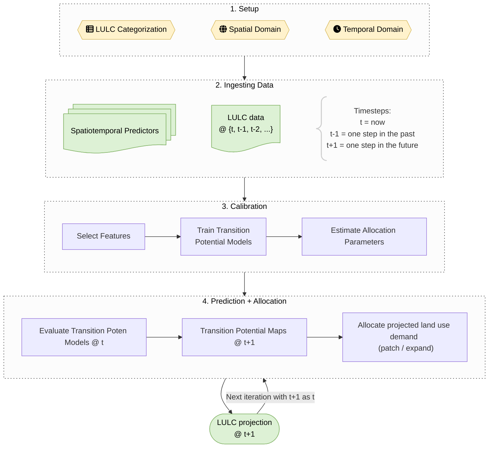

# evoland-plus

**evoland** **v**isualizes, **o**ptimizes, **l**ocalizes and **a**nd **d**etermines **p**redictable **l**and **u**se **s**hifts

## Overview

The `evoland-plus` R package (or `evoland` for short) provides tools for analyzing and projecting land use evolution. The package implements a statistically calibrated, constrained model for predicting locations of future land use / land cover change (LULCC).
The fundamental purpose of `evoland-plus` is to:

- **Gather and process** land use/land cover data from multiple sources into a clearly defined database structure.
- **Calibrate statistical models** to understand historical land use transitions
- **Project future land use patterns** using predictive models and allocation algorithms
- **Support scenario analysis** through interventions and parameter modifications



## Development Environment Setup

We suggest you use [rv](https://a2-ai.github.io/rv-docs/) to manage dependencies.
Simply create an `rproject.toml` at the project root and execute `rv sync`.

```toml
# sample rproject.toml
[project]
name = "evoland-plus"
r_version = "4.5"

repositories = [
    { alias = "CRAN", url = "https://stat.ethz.ch/CRAN/" },
]

dependencies = [
    { name = "evoland", path = ".", dependencies_only = true, install_suggestions = true },
    "devtools", # sundry development tasks
    "mirai", # modern multiprocessing
    "httpgd", # webview plotting
    "languageserver", # assuming your IDE loads the rv library instead of system
]
```

During development, `devtools::load_all()` acts as though you were calling `library(evoland)` on an installed package.
This makes it easy to rapidly reload code when you've changed something.
Code must be autoformatted using [air](https://posit-dev.github.io/air/) before committing.

## Documentation

This package uses pkgdown, see <http://ethzplus.github.io/evoland-plus>.

- **Tutorials & How-to Guides**: Package vignettes and examples in R man pages
- **Reference Documentation**: R man pages using the standard `?function_name`
- **Explanation & Design Rationale**: See the [project wiki](../../wiki) for
    - Detailed explanation of the modeling approach
    - Database schema and architecture decisions
    - Development guidelines and coding standards

## License

This project is licensed under the AGPL-3 License - see the [LICENSE.md](LICENSE.md) file for details.

## Contributing

Don't hesitate to get in contact with @mmyrte and/or @blenback if you'd like to contribute!

## Acknowledgments

This work represents a re-implementation and enhancement of [Benjamin Black's](/blenback) land use model published at <https://github.com/ethzplus/evoland-plus-legacy>, building on substantial prior experience while modernizing the technical implementation.
