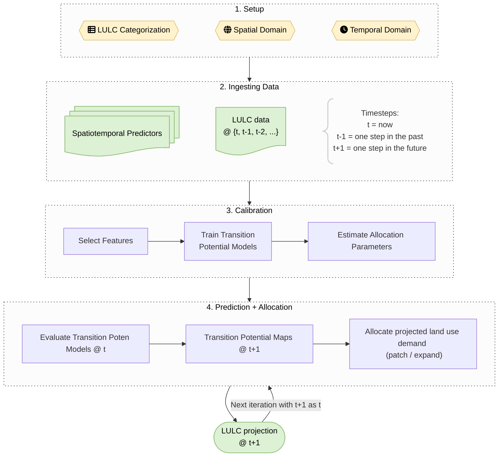
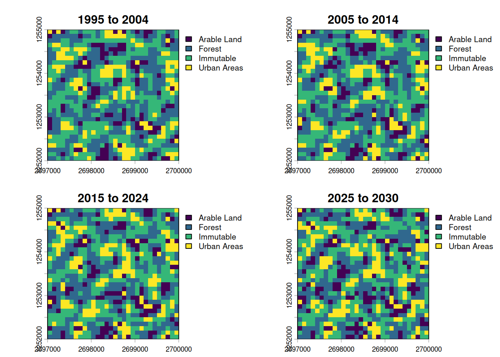
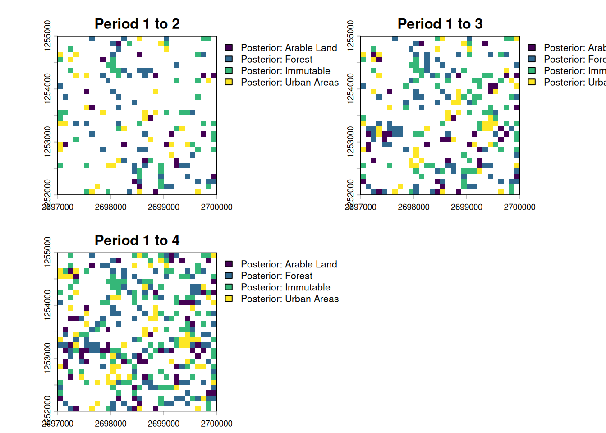

# `evoland-plus` tutorial

*Note: This tutorial expects that you already know about geodata and
some central principles of pattern-based land use change modelling.*

This file introduces the `evoland-plus` R package, or `evoland` for
short. `evoland-plus` builds on the idea that land use change can be
predicted from observed change patterns. The likelihood that a location
and its neighbors will change state is called *transition potential* and
is estimated per location. A concrete realization of all possible
transitions (e.g. forest-\>grass, grass-\>forest, etc.) is realized in
an *allocation* across all locations and classes. Because the transition
potential is spatially and temporally autocorrelated, an extrapolation
must be autoregressive.

## Workflow



## 1 Setup

We’ll use the following packages:

``` r

library(evoland)
library(data.table)
library(terra)
```

### 1.1 Creating an `evoland` database

First, we load the package and create an `evoland_db` database object:
unlike most R objects (e.g. `data.frame`), this is a mutable object[^1],
meaning we can alter its state like we would with a Python object. This
nicely mirrors our persistent database on disk.

If there is no directory at `path`, we’ll create a new DB: a set of
parquet files following clearly defined parquet files. If there *is* a
directory, we resume from where we left off.

``` r

db <- evoland_db$new(path = "firstmodel.evolanddb")
```

Messages

    duckdb: caching downloaded extensions in the package library:
    ℹ /home/runner/work/_temp/Library/duckdb/extensions
    ℹ This is removed when the package is re-installed; see `?duckdb_storage` to choose a different location.

Go ahead and print the `db` object. There are already a `runs_t` and a
`reporting_t` table, which are bare-bones for now but will be used to
track our [modelling
runs](https://ethzplus.github.io/evoland-plus/reference/runs_t.md) and
metadata for producing graphs and tables.

``` r

db
```

    <evoland_db> Object. Inherits from <parquet_db>
     | Database: firstmodel.evolanddb
     | Write Options: format parquet, compression zstd
     | Active Run: 0
     | Lineage: 0

    Tables Present:
      reporting_t, runs_t

    DB Methods:
      column_max, commit, delete_from, execute, fetch, get_query, get_read_expr,
      get_table_metadata, get_table_path, list_tables, row_count

    Public Methods:
      add_predictor, adjusted_trans_pot_v, alloc_clumpy, alloc_dinamica,
      alloc_params_clumpy_v, create_alloc_params_t, eval_alloc_params_t,
      fit_full_models, fit_partial_models, generate_neighbor_predictors,
      get_crossval_plots, get_obs_trans_rates, get_pred_filter_score,
      lulc_data_as_rast, pred_data_wide_v, predict_trans_pot, set_full_trans_preds,
      set_neighbors, set_report, trans_pred_data_v, trans_rates_dinamica_v,
      upsert_new_neighbors

    Active Bindings:
      coords_minimal, extent, id_run, lulc_meta_long_v, pred_sources_v, run_lineage,
      trans_v

### 1.2 Defining our model framework

Before we do anything else, let’s declare the framework of our model:

- **Land Use / Cover Categories**: A set of *land use and/or land cover
  classes* between which changes can occur
- **Spatial Domain**: A set of *coordinates*, built from a geographic
  specification
- **Temporal Domain**: A set of *periods*, describing a regular time
  series

#### 1.2.1 LULC Categories

We define our fundamental LULC classes. The `src_classes` field maps the
underlying data source’s classes to our conceptual categories.

``` r

db$lulc_meta_t <- create_lulc_meta_t(
  list(
    forest = list(
      pretty_name = "Forest",
      description = "Areas with lots of trees",
      src_classes = 1:3
    ),
    arable = list(
      pretty_name = "Arable Land",
      src_classes = c(4, 8)
    ),
    urban = list(
      pretty_name = "Urban Areas",
      description = "Where nature goes to die",
      src_classes = 5:7
    ),
    static = list(
      pretty_name = "Immutable",
      description = "Areas where we cannot conceptualize change",
      src_classes = 9:10
    )
  )
)
```

#### 1.2.2 Spatial domain

The spatial coordinate points provide the fundamental geographic domain
on which our model will operate. We use a dense square raster, but since
we register individual coordinate points, we could subset these to any
oddly shaped region of interest.

``` r

# template SpatRaster: 30x30 grid in Swiss LV95, later used for synthetic data generation
template_rast <- terra::rast(
  crs = "EPSG:2056",
  extent = terra::ext(c(
    xmin = 2697000,
    xmax = 2700000,
    ymin = 1252000,
    ymax = 1255000
  )),
  resolution = 100
)

db$coords_t <- create_coords_t_square(
  epsg = terra::crs(template_rast, describe = TRUE)$code |> as.integer(),
  extent = terra::ext(template_rast),
  resolution = terra::res(template_rast)[1]
)
```

You can retrieve coords_t from disk and filter using [`data.table`
semantics](https://raw.githubusercontent.com/rstudio/cheatsheets/master/datatable.pdf):

``` r

db$coords_t[lon == 2699650]
```

    Coordinate Table
    longitude (x) range: [2699650, 2699650]
    latitude  (y) range: [1252050, 1254950]
    Key: <id_coord>
        id_coord     lon     lat elevation geom_polygon
           <int>   <num>   <num>     <num>       <list>
     1:       27 2699650 1254950        NA       [NULL]
     2:       57 2699650 1254850        NA       [NULL]
     3:       87 2699650 1254750        NA       [NULL]
     4:      117 2699650 1254650        NA       [NULL]
     5:      147 2699650 1254550        NA       [NULL]
    ---
    26:      777 2699650 1252450        NA       [NULL]
    27:      807 2699650 1252350        NA       [NULL]
    28:      837 2699650 1252250        NA       [NULL]
    29:      867 2699650 1252150        NA       [NULL]
    30:      897 2699650 1252050        NA       [NULL]

We can also retrieve a minimal representation (id, lat, lon) using an
active binding, i.e. a method tied to the database that dynamically
computes a property when called:

``` r

db$coords_minimal[1:2]
```

    Key: <id_coord>
       id_coord     lon     lat
          <int>   <num>   <num>
    1:        1 2697050 1254950
    2:        2 2697150 1254950

#### 1.2.3 Temporal domain

We also define our temporal domain. Note that an additional “0th” period
is added at the end of the observed range; this is used for labelling
predictor or intervention data as static.

``` r

db$periods_t <- create_periods_t(
  period_length_str = "P10Y", # 10 year period
  start_observed = "1995-01-01",
  end_observed = "2020-01-01",
  end_extrapolated = "2030-01-01"
)
```

## 2 Ingesting Data

### 2.1 LULC Data

For this tutorial, we do not read real observed LULC data: instead, we
generate a synthetic LULC raster with 3 layers (one per period) by
adding autoregressive noise to a noisy raster.

``` r

# autoregressive noise with skellam distribution
n_cells <- dim(template_rast)[1] * dim(template_rast)[2]
noise1 <- runif(n_cells, min = 0, max = 10)
noise2 <- noise1 + stats::rpois(n_cells, 0.2) - stats::rpois(n_cells, 0.2)
noise3 <- noise2 + stats::rpois(n_cells, 0.2) - stats::rpois(n_cells, 0.2)

synthetic_lulc <-
  rast(template_rast, nlyrs = 3, vals = c(noise1, noise2, noise3)) |>
  focal(w = 3, fun = mean, na.rm = TRUE) |>
  clamp(lower = 0, upper = 10) |>
  classify(
    rcl = data.frame(
      from = 0:9,
      to = 1:10,
      becomes = c(3, 7, 1, 10, 5, 8, 2, 9, 4, 6)
    )
  )

plot(synthetic_lulc, nc = 3)
```


We now extract the generated values at our coordinates using
`extract_using_coords_t`, giving us a tabular representation of
`id_coord, id_period, src_class` tuples. In a second step, we join in a
long representation of the LULC metadata, associating `id_lulc` with
`src_class`.

``` r

synthetic_at_coords <- extract_using_coords_t(synthetic_lulc, db$coords_t)

synthetic_joint_meta <-
  synthetic_at_coords[, .(
    id_coord,
    id_period = substr(layer, 4, 4) |> as.integer(),
    src_class = value
  )][
    db$lulc_meta_long_v, # map from id_lulc to src_class
    on = .(src_class),
    nomatch = NULL
  ]
```

We now have the LULC data in an almost canonical format. We need to add
information on which `id_run` this data belongs to: run 0 is the base
run, providing observed data (see
[`db$runs_t`](https://ethzplus.github.io/evoland-plus/reference/runs_t.md)
for details). The call to
[`as_lulc_data_t`](https://ethzplus.github.io/evoland-plus/reference/lulc_data_t.md)
ensures that the data we want to insert actually conforms to the form we
are expecting.

``` r

db$lulc_data_t <- as_lulc_data_t(synthetic_joint_meta[, .(
  id_run = 0L, # Base run ID
  id_period,
  id_lulc,
  id_coord
)])
```

Now that we have LULC data in our DB, we can derive data from it,
e.g. we grab a view where a transition occurred, i.e. the anterior and
posterior LULC ID are not the same.

``` r

db$trans_v[id_lulc_anterior != id_lulc_posterior]
```

         id_period id_lulc_anterior id_lulc_posterior id_coord
             <int>            <int>             <int>    <int>
      1:         2                3                 2        7
      2:         2                3                 2       13
      3:         3                2                 3       13
      4:         3                4                 3       15
      5:         2                1                 4       16
     ---
    288:         3                2                 1      885
    289:         2                1                 4      886
    290:         2                4                 1      889
    291:         2                1                 4      897
    292:         3                4                 3      899

### 2.2 Add Predictors and Neighbors

You have seen above how
[`extract_using_coords_t`](https://ethzplus.github.io/evoland-plus/reference/util_terra.md)
can be used to transform a `SpatRaster` into a tabular form. It can also
be used with `SpatVector` objects, and the resulting tables need not
just be LULC data: we could also use it to extract predictor
information. For demo purposes, we’ll use test data that comes with
`evoland`. Note that the metadata holds a `fill_value` used to define
what value should be used at a coordinate point with no explicit data
set - e.g. if a square kilometre does not have a population count set,
we can infer that it should be zero.

``` r

db$pred_meta_t <- evoland:::test_pred_meta_t
db$pred_data_t <- evoland:::test_pred_data_t
```

Statistical models like GLMs or random forests lack inherent spatial
concepts, so we explicitly calculate neighborhood relations for each
coordinate to create spatial predictors (e.g., “number of neighboring
forest cells within 100m”). This is done by creating a neighbor lookup
table
([`db$set_neighbors`](https://ethzplus.github.io/evoland-plus/reference/neighbors_t.md)
and then counting the number of neighbors within each distance break
class and land use category (`db$generate_neighbor_predictors`).

``` r

db$set_neighbors(
  max_distance = 1000,
  distance_breaks = c(0, 100, 500, 1000),
  quiet = TRUE
)
```

``` r

db$generate_neighbor_predictors()
```

Messages

    Computed 208360 neighbor relationships
    Appended 8 neighbor predictor variables with 21583 data points

Have a look at the predictor metadata we have defined, it now contains
new rows for the neighbor predictors:

``` r

db$pred_meta_t
```

    Predictor Metadata Table
    Number of predictors: 12
    Key: <name>
        id_pred                       name
          <int>                     <char>
     1:       1                  elevation
     2:      10   id_lulc_1_dist_[100,500)
     3:       6 id_lulc_1_dist_[500,1e+03]
     4:       9   id_lulc_2_dist_[100,500)
     5:       5 id_lulc_2_dist_[500,1e+03]
     6:      12   id_lulc_3_dist_[100,500)
     7:       8 id_lulc_3_dist_[500,1e+03]
     8:      11   id_lulc_4_dist_[100,500)
     9:       7 id_lulc_4_dist_[500,1e+03]
    10:       3               is_protected
    11:       2                 population
    12:       4                  soil_type
    8 variables not shown: [pretty_name <char>, description <char>, orig_format <char>, sources <list>, unit <char>, factor_levels <list>, data_type <fctr>, fill_value <char>]

## 3 Calibration

For consistency across different model packages, `evoland-plus` uses the
[`mlr3`](https://mlr-org.com/) machine learning and statistics
environment. For a hands-on introduction, see [mlr3 by
Example](https://mlr3book.mlr-org.com/chapters/chapter1/introduction_and_overview.html#mlr3-by-example).

### 3.1 Eligible Transitions and Predictor Pruning

We filter transitions eligible for modeling based on a minimum number of
observed occurrences.

``` r

db$trans_meta_t <- create_trans_meta_t(db$trans_v, min_cardinality_abs = 20)
```

Because each transition may be modelled using different predictors (aka
*features*), we start out by setting the `trans_preds_t` table to the
full cross product of viable transitions and predictors. We then carry
out a feature selection step in `get_pred_filter_score`, which here is
used with a variable [importance
filter](https://mlr3filters.mlr-org.com/reference/mlr_filters_importance.html) -
an [mlr3 Learner](https://mlr3.mlr-org.com/reference/Learner.html) is
passed that returns an importance score for each predictor. We can then
subset the returned `trans_preds_t` object and overwrite the existing
set of “every predictor for every transition”. The assignment to
`db$trans_preds_t` will overwrite the existing relations; you will be
prompted if you want to do this if you’re running R interactively.

``` r

# set full crossproduct of transitions - predictors
db$set_full_trans_preds()
```

    [1] 72

``` r

# return importance scores for each predictor - transition combination
trans_pred_scored <- db$get_pred_filter_score(
  filter = mlr3filters::FilterImportance$new(
    learner = mlr3::lrn("classif.rpart")
  )
)
```

``` r

# overwrite using a subset
db$trans_preds_t <- trans_pred_scored[
  importance > 5 |
    is.na(importance) # keep predictors that couldn't be scored
]
```

Messages

    Processing 6 transitions...

### 3.2 Transition Models

Now we fit partial models using training/validation splits, allowing for
a goodness-of-fit estimation using [mlr3
Measures](https://mlr3book.mlr-org.com/chapters/chapter2/data_and_basic_modeling.html#sec-eval).
We fit a first series of models using a featureless learner, i.e. only
estimating the response from the target variable (did a transition
occur?) probability distribution. We then fit an
[rpart](https://mlr3.mlr-org.com/reference/mlr_learners_classif.rpart.html)
recursive partitioning and regression learner. Next,
[`fit_full_models()`](https://ethzplus.github.io/evoland-plus/reference/trans_models_t.md)
reads the partial models stored in `db$trans_models_t`, chooses the best
model for each transition based on goodness of fit, and refits each
chosen model on all available predictor data. Assigning the result back
to db\$trans_models_t stores these full models for the extrapolation
step.

``` r

db$trans_models_t <- db$fit_partial_models(
  learner = mlr3::lrn("classif.featureless"),
  measures = c("classif.auc", "classif.acc"),
  sample_frac = 0.7,
  seed = 666
)
```

``` r

db$trans_models_t <- db$fit_partial_models(
  learner = mlr3::lrn("classif.rpart"),
  measures = c("classif.auc", "classif.acc"),
  sample_frac = 0.7,
  seed = 666
)
```

``` r

db$trans_models_t <- db$fit_full_models(
  select_score = "classif.auc",
  select_maximize = TRUE
)
```

Messages

    Fitting partial models for 6 transitions...
    Fitting partial models for 6 transitions...
    Fitting full models for 6 transitions...

### 3.3 Transition Rates and Allocation Parameters

As a constrained pattern-based model, we need to provide transition
rates to the DinamicaEGO allocator. In a simple approach, we can
extrapolate the rate of each transition from the observed data:

``` r

db$trans_rates_t <-
  db$get_obs_trans_rates() |>
  extrapolate_trans_rates(
    periods = db$periods_t,
    coord_count = n_cells
  )
```

We estimate allocation parameters, which determine the shape and size of
new patches, respectively which fraction of converted land use is in new
versus expanded patches. This estimation procedure is not unbiased and
hence a single estimate may not be enough: normally, we would perturb
the estimate and use multiple `id_run`s to identify the best
parametrization. For simplicity, we now just take the estimates for
granted and assign `id_run=0`, i.e. the base run ID.

``` r

alloc_for_eval <- db$create_alloc_params_t(n_perturbations = 0)
```

``` r

alloc_for_eval[, id_run := 0L] # overwrite id_run=1
db$alloc_params_t <- alloc_for_eval
```

Messages

    Computing allocation parameters for 6 transitions across 2 periods...
      Processing period 1 -> 2
      Processing period 2 -> 3
    Aggregating parameters across periods...
    Creating 0 randomly perturbed versions per transition...
    Successfully computed 6 allocation parameter sets (6 transitions x (0 perturbations + best estimate))

## 4 Prediction + Allocation

For this tutorial, we will use the CLUMPY backend for a self-contained
stochastic allocation that does not require the presence of
[DinamicaEGO](https://ethzplus.github.io/evoland-plus/articles/install-dinamica.md)
as an external solver.

``` r

db$alloc_clumpy(
  id_period = db$periods_t[is_extrapolated == TRUE, id_period], # select all extrapolation periods
  select_score = "classif.auc",
  select_maximize = TRUE,
  seed = 42L # optional: reproducibility
)
```

Messages

    Starting CLUMPY allocation simulation
    Periods: 4
    Run: 0
    === Iteration 1/1 ===
    Predicting transition potential for 6 transitions
    Predicting trans 1/6 (id_trans 5)
    Predicting trans 2/6 (id_trans 7)
    Predicting trans 3/6 (id_trans 2)
    Predicting trans 4/6 (id_trans 1)
    Predicting trans 5/6 (id_trans 6)
    Predicting trans 6/6 (id_trans 3)
    Running CLUMPY allocation (uPAM): period 3 -> 4
      Converting posterior vector to lulc_data_t...
      Allocated 900 cells
    Iteration 1 complete
    CLUMPY allocation complete!

### 4.1 Visualization

Finally, we can extract the simulated LULC maps into `SpatRaster`
objects to visualize them.

``` r

labels <- db$periods_t[
  id_period != 0,
  paste0(year(start_date), " to ", year(end_date))
]
plot_maps <-
  db$lulc_data_as_rast() |>
  categories(
    layer = 0, # set for all layers
    value = data.frame(id = 1:4, name = db$lulc_meta_t$pretty_name)
  ) |>
  setNames(labels)

plot(plot_maps)
```



Due to the extrapolated transition rates, the last step shows a similar
difference as exists between the first three periods. We can also show
the cumulative difference like so:

``` r

changes <-
  c(
    create_change_map(plot_maps[[1]], plot_maps[[2]]),
    create_change_map(plot_maps[[1]], plot_maps[[3]]),
    create_change_map(plot_maps[[1]], plot_maps[[4]])
  ) |>
  categories(
    layer = 0,
    value = data.frame(id = 1:4, name = paste("Posterior:", db$lulc_meta_t$pretty_name))
  ) |>
  setNames(paste("Period 1 to", 2:4))

plot(changes)
```



[^1]: Specifically, we’re creating an R6 object instead of an S3 or S4
    one. This is called “encapsulated object oriented programming”
    (cf. [Advanced R](https://adv-r.hadley.nz/r6.html)) and you might
    know it from Python (e.g. `pandas_df.drop_duplicates()`).
