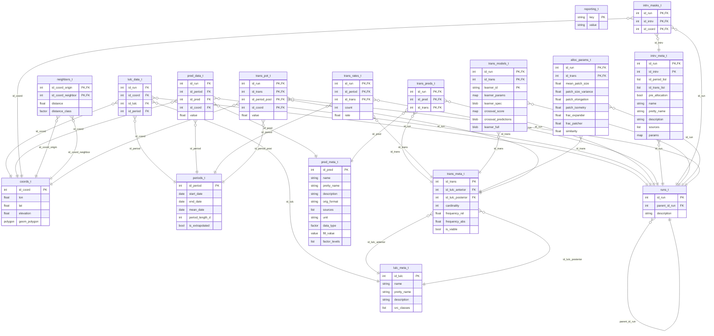

# Data model

## Overview

The analytic workflow is centrally managed around a relational database.
The database is a [DuckLake](https://ducklake.select/) catalog, accessed through an in-memory [DuckDB](https://duckdb.org/) instance, holding the tables described below.
By default a database is one folder: the catalog in `<path>/catalog.sqlite`, the data as Parquet files under `<path>/data/`.
The catalog can also live in PostgreSQL and the data in object storage (S3 and similar), so several machines can work on one database.

DuckLake was chosen over plain Parquet files because it gives atomic writes and snapshot isolation: several processes can write to one database concurrently, and a reader never sees a half-written table.
It supports no constraints, keys, indexes or ENUM types, so `ducklake_db$commit()` enforces key uniqueness itself, and factors are stored as strings and cast back by the `as_*_t()` constructors.
The keys, partitioning and map columns of each table are declared by its `as_*_t()` constructor and stored as metadata on the catalog table.

Because other tools may read and write the catalog, table and column names are part of the package's API; see [../style/r.md](../style/r.md#schema-names).

> [!TIP]
> Managing model state is, in theory, possible by using declarative configuration files. During
> early development of the package, it became clear that configuration files would need to be
> hyperspecific to adequately describe all assumptions that go into a specific analysis. Adequately
> implementing e.g. data ingestion for multiple sources would lead to a massive scope expansion of
> the package. Hence, there is not currently a concept of declarative configuration in this database.
> This may need to be revised.

## Tables

- `reporting_t`: Key-value store for report metadata
- `coords_t`: Landscape tessellation (base grid, polygons, centroids)
- `periods_t`: Time periods metadata
- `runs_t`: Scenario/run hierarchy for multi-run simulations
- `lulc_data_t` + `lulc_meta_t`: LULC data and metadata
- `pred_data_t` + `pred_meta_t`: Predictor data and metadata
- `trans_meta_t`: Transition metadata, indicating the viability of modelling them from a statistical or conceptual point
- `trans_preds_t`: Transitions and their associations to predictors (m to n relation)
- `trans_rates_t`: Transition rates by period
- `intrv_masks_t` + `intrv_meta_t`: Interventions (masks, values) with their parameters (struct/json)
  - Examples: Forced assignment of deglaciating areas, reduced likelihood of transition in protected areas
- `trans_models_t`: Storing model metadata and model objects
- `alloc_params_t`: Storing the allocation parametrization
- `neighbors_t`: Neighbor relationships between coordinates
- `trans_pot_t`: Per-coordinate transition potential, per run

### `reporting_t`

This table is a simple key/value (varchar) store for reporting metadata.
It contains information such as author, datetime, scenario title, etc.

| pk  | colname | type | description                   |
| --- | ------- | ---- | ----------------------------- |
| \*  | key     | str  | Unique key for the entry      |
|     | value   | str  | Value associated with the key |

Default keys set on DB initialization:

- `report_name`: Short name for the report (default: "evoland_scenario")
- `report_name_pretty`: Display name for the report
- `report_include_date`: Whether to include date in reports
- `creator_username`: Username of the creator
- `last_opened`: Timestamp of last access
- `last_opened_username`: Username of last accessor

### `coords_t`

| pk  | colname      | type              | description                                   |
| --- | ------------ | ----------------- | --------------------------------------------- |
| \*  | id_coord     | int               | Unique ID for each reference coordinate pair  |
|     | lon          | float             | aka x coord                                   |
|     | lat          | float             | aka y coord                                   |
|     | elevation    | float, nullable   | aka z coord                                   |
|     | geom_polygon | polygon, nullable | If the point describes a surface, its polygon |

The `coords_t` table specifies the basic coordinates at which the model is set up and run.
Because these coordinates will often also refer to a surface, a polygon describing each surface may be stored alongside the lat/lon coordinates.
This table is either constructed based on reference grid specification (e.g. existing LULC data) or derived from parameters (e.g. a hexagonal grid with edge length S and origin at (P, Q)).

An optional `region` column of type factor may also be present; it is preserved and cast if supplied.

Additional attributes are stored as table metadata (via `setattr`):

- `epsg`: EPSG code for the coordinate reference system
- `xmin`, `xmax`, `ymin`, `ymax`: Bounding box extent
- `resolution`: Grid resolution (for regular grids)

> [!NOTE]
> The CRS is currently stored only as a table attribute, not as a persisted column. There is no
> dedicated column for it in `coords_t`. This may need to be revisited for full round-trip
> reproducibility.

### `periods_t`

| uniqueness | colname         | type | description                                                    |
| ---------- | --------------- | ---- | -------------------------------------------------------------- |
| alternate  | id_period       | int  | Unique ID for each period                                      |
| \*         | start_date      | date | Inclusive boundary for start                                   |
| \*         | end_date        | date | Inclusive boundary for end                                     |
|            | mean_date       | date | Midpoint of the period, derived                                |
|            | period_length_d | int  | Days between this and the preceding period's midpoint, derived |
|            | is_extrapolated | bool | False if observation, true if extrapolated                     |

This table identifies periods in the past and future.
It is populated using a start and end date for the observation period, and an end date for the extrapolation, plus a time step length.
Each period is left-inclusive, i.e. in case of doubt assigned to the anterior class in a transition, not the posterior.
For static predictors (variables that do not change over time), a "0 period" is used in the database to indicate their timeless nature, starting and ending at the end of the observed periods. This allows static predictors to be stored and referenced consistently alongside time-varying predictors, even though they do not correspond to a specific time period.

### `runs_t`

| pk  | colname       | type          | description                                   |
| --- | ------------- | ------------- | --------------------------------------------- |
| \*  | id_run        | int           | Unique ID for each run (0 = base/unperturbed) |
|     | parent_id_run | int, nullable | FK to runs_t for hierarchical scenarios       |
|     | description   | str           | Human-readable description of the run         |

This table supports multi-run simulations and scenario management. Run ID 0 is reserved for the base/unperturbed scenario. Child runs can reference a parent run to establish scenario hierarchies: the most specific available set of data is used. For instance, if a predictor value is not available for a specific run, the system falls back to the parent run's value, continuing up the hierarchy until a value is found or the base run is reached.

### `lulc_data_t` + `lulc_meta_t`

`lulc_meta_t` describes metadata for each Land Use / Land Cover class.

| pk  | colname     | type             | description                                               |
| --- | ----------- | ---------------- | --------------------------------------------------------- |
| \*  | id_lulc     | int              | Unique ID for each land use class                         |
|     | name        | str (unique key) | Name for use in code and queries, e.g. `forest_dense`     |
|     | pretty_name | str              | Long name for plots/output e.g. _Dense/Old Growth Forest_ |
|     | description | str              | Long description / operationalisation                     |
|     | src_classes | list             | List of source class IDs that map to this class           |

The `src_classes` column allows mapping from source data class IDs to the harmonized LULC classes used in the model.

`lulc_data_t` indicates that at a given place and time, a certain land use is detected/projected.
To transform these sparse data for a given id_period to a dense matrix, you would join the `id_lulc` to the `coords_t`.
If `coords_t` represents a dense raster, you can reshape the 1D-vector.
If `coords_t` is irregular, you can rasterize according to your raster specs.

| uniqueness | colname   | type | description                   |
| ---------- | --------- | ---- | ----------------------------- |
| \*         | id_run    | int  | FK from `runs_t` (0 for base) |
| \*         | id_coord  | int  | FK from `coords_t`            |
|            | id_lulc   | int  | FK from `lulc_meta_t`         |
| \*         | id_period | int  | FK from `periods_t`           |

The table is partitioned by `id_run` for efficient storage and retrieval.

Some observational datasets, e.g. the Swiss [_Surface Statistics_](https://www.bfs.admin.ch/bfs/de/home/statistiken/raum-umwelt/nomenklaturen/arealstatistik.html), may have exact dates associated with individual `id_coord, id_lulc` combinations. If desired, these data should be added as predictors - e.g. in "number of years before or after the id_period".

### `pred_data_t` + `pred_meta_t`

`pred_meta_t` describes metadata for each predictor.

| pk  | colname       | type                                       | description                                            |
| --- | ------------- | ------------------------------------------ | ------------------------------------------------------ |
| \*  | id_pred       | int (autoincrement)                        | Unique ID for each predictor                           |
|     | name          | str (unique key)                           | Name for use in code and queries, e.g. `distance_road` |
|     | pretty_name   | str                                        | Name of the predictor, e.g. _Distance To Closest Road_ |
|     | description   | str, nullable                              | Long description / operationalisation                  |
|     | orig_format   | str, nullable                              | Orig. format: "polygons, annual", "100m raster, daily" |
|     | sources       | list of structs (url, md5sum)              | Where the data were fetched (maybe validate URL)       |
|     | unit          | str, nullable                              | SI-compatible unit, nullable for categorical values    |
|     | data_type     | factor (int, float, bool, factor, ordered) | Data type for coercion of stored values                |
|     | fill_value    | any, nullable                              | Value substituted for missing coordinate points        |
|     | factor_levels | list of character vectors                  | Ordered level labels when `data_type = "factor"`       |

`pred_data_t` stores the actual predictor observations. All predictor types share a single table and a single `value` column stored as float. The `data_type` and `factor_levels` columns in `pred_meta_t` are used to coerce values back to their correct type when reading.

| uniqueness | colname   | type  | description                   |
| ---------- | --------- | ----- | ----------------------------- |
| \*         | id_run    | int   | FK from `runs_t` (0 for base) |
| \*         | id_period | int   | FK from `periods_t`           |
| \*         | id_pred   | int   | FK from `pred_meta_t`         |
| \*         | id_coord  | int   | FK from `coords_t`            |
|            | value     | float | Predictor value               |

The table is partitioned by `(id_run, id_period)` for efficient storage and retrieval.

> [!NOTE]
> Earlier versions of the design split predictor storage into typed sub-tables
> (`pred_data_t_float`, `pred_data_t_int`, `pred_data_t_bool`). The current implementation
> uses a single `pred_data_t` with a `float` value column for all types. The `data_type` field
> in `pred_meta_t` is used for coercion on read. Factor predictors are stored as integers and
> reconstructed using `factor_levels`.

### `trans_meta_t`

Relates land use classes to each other (henceforth _transitions_), including statistics about their frequency in the original data and, essentially, an indicator on whether they are viable for modelling.
Example of non-viability: A model may contain an "other" class that is valuable for a simplified representation of what an initial class might transition into.
Since this "other" class holds no information on what class may come next, the "other" class could only increase in area, but never decrease.
Another exemption for the viability of modelling a transition is because the set of observations may be too limited for statistical inference.

> [!NOTE]
> The previous generation of evoland considered the viability of modelling a transition for each `id_period`.
> By tying the identity of a transition to a (training) period, we lose out on the data provided by previous periods.
> The identification of a transition with a period needs to be discussed.

| pk  | uniqueness | colname           | type                | description                                                                  |
| --- | ---------- | ----------------- | ------------------- | ---------------------------------------------------------------------------- |
| \*  |            | id_trans          | int (autoincrement) | Unique ID for each transition                                                |
|     | \*         | id_lulc_anterior  | int                 | FK from `lulc_meta_t`, id before transition                                  |
|     | \*         | id_lulc_posterior | int                 | FK from `lulc_meta_t`, id after transition                                   |
|     |            | cardinality       | int                 | How many times this transition occurred                                      |
|     |            | frequency_rel     | float               | Frequency of this transition in relation to all transitions in this timestep |
|     |            | frequency_abs     | float               | Frequency of this transition in relation to all coordinates                  |
|     |            | is_viable         | bool                | See explanation                                                              |

### `trans_preds_t`

An m to n relation enumerates all the predictors useful for modelling a particular transition.
This table is populated by a feature selection step that precedes the actual model training.
In the absence of a feature selection step, it would default to the cartesian product of predictors and transitions.

| uniqueness | colname  | type | description            |
| ---------- | -------- | ---- | ---------------------- |
| \*         | id_run   | int  | FK from `runs_t`       |
| \*         | id_pred  | int  | FK from `pred_meta_t`  |
| \*         | id_trans | int  | FK from `trans_meta_t` |

### `trans_rates_t`

Stores transition rates (probabilities) for each transition type in each time period. Historical rates are calculated from observed transitions, and future rates can be extrapolated using linear regression.

| uniqueness | colname   | type  | description                                                          |
| ---------- | --------- | ----- | -------------------------------------------------------------------- |
| \*         | id_run    | int   | FK from `runs_t`                                                     |
| \*         | id_period | int   | FK from `periods_t`                                                  |
| \*         | id_trans  | int   | FK from `trans_meta_t`                                               |
|            | count     | int   | Absolute count of transitions observed in this (id_trans, id_period) |
|            | rate      | float | Transition rate: count / total anterior-class cells (non-negative)   |

### `intrv_masks_t` + `intrv_meta_t`

Tables containing auxiliary information for _interventions_, that is: manipulations of LULC transition potential, or outright overrides of LULC change predictions.
`intrv_meta_t` describes metadata for each intervention.

| pk  | uniqueness | colname        | type                          | description                                               |
| --- | ---------- | -------------- | ----------------------------- | --------------------------------------------------------- |
| \*  | \*         | id_run         | int                           | FK from `runs_t`                                          |
| \*  | \*         | id_intrv       | int                           | Unique ID for each intervention (unique within id_run)    |
|     |            | id_period_list | list(int)                     | Associated periods for intervention                       |
|     |            | id_trans_list  | list(int)                     | Associated transitions for intervention                   |
|     |            | pre_allocation | bool                          | Whether intervention occurs before allocation step        |
|     |            | name           | str                           | Name for use in code and queries, e.g. `pa_expansion`     |
|     |            | pretty_name    | str                           | Name of the intervention, e.g. _Protected Area Expansion_ |
|     |            | description    | str                           | Long description / operationalisation                     |
|     |            | sources        | list of structs (url, md5sum) | Where the data were fetched (maybe validate URL)          |
|     |            | params         | map                           | Intervention parameters, structured as key-value pairs    |

`intrv_masks_t` is used to store intervention masks, defining which coordinate pairs are affected by each intervention.
The presence of `(id_run, id_intrv, id_coord)` indicates a positive mask value, i.e. a given coordinate pair is affected by a given intervention for a given run.

| uniqueness | colname  | type | description            |
| ---------- | -------- | ---- | ---------------------- |
| \*         | id_run   | int  | FK from `runs_t`       |
| \*         | id_intrv | int  | FK from `intrv_meta_t` |
| \*         | id_coord | int  | FK from `coords_t`     |

### `trans_models_t`

Transition models: For each viable `id_trans`, there may be multiple models in this table.
The table is populated in the following manner:

1. For each transition, split into a training and validation set
2. Try out many model specifications, write model and metadata to this table
3. Identify best performing models (group by `id_trans`; sort by `crossval_score['some_metric']`; limit to 1)
4. Refit best models on full data

| uniqueness | colname              | type | description                                                                                         |
| ---------- | -------------------- | ---- | --------------------------------------------------------------------------------------------------- |
| \*         | id_run               | int  | FK from `runs_t`                                                                                    |
| \*         | id_trans             | int  | FK from `trans_meta_t`                                                                              |
| \*         | learner_id           | str  | mlr3 learner key, e.g. `"classif.ranger"`                                                           |
|            | learner_params       | map  | Map of atomic scalar learner hyperparameters for querying                                           |
|            | learner_spec         | blob | BLOB of serialized untrained mlr3 `Learner`; for AutoTuners, the optimal inner learner after tuning |
|            | crossval_score       | map  | Map of cross-validation performance scores (from `prediction$score(measures)`)                      |
|            | crossval_predictions | blob | BLOB of serialized mlr3 `PredictionClassif` on the held-out test split                              |
|            | learner_full         | blob | BLOB of serialized trained mlr3 `Learner` fitted on the full dataset, used for extrapolation        |

The table is partitioned by `id_run`.

The `learner_spec` blob captures the complete learner configuration and can be deserialized with `qs2::qs_deserialize()` to reproduce the model fitting process. The `learner_full` blob is populated in a second pass by refitting the best cross-validated learner on the full dataset.

### `alloc_params_t`

| uniqueness | colname             | type  | description                                                                                          |
| ---------- | ------------------- | ----- | ---------------------------------------------------------------------------------------------------- |
| \*         | id_run              | int   | FK from `runs_t` (0 = unperturbed base estimate)                                                     |
| \*         | id_trans            | int   | FK from `trans_meta_t`                                                                               |
|            | mean_patch_size     | float | Mean area of new patches (in cell units)                                                             |
|            | patch_size_variance | float | Variance of patch area (in cell units)                                                               |
|            | patch_elongation    | float | Mean patch elongation, 0 (isometric) to 1 (linear); see `src/clumpy_geometry.h`                      |
|            | patch_isometry      | float | Dinamica patcher isometry parameter, derived from `patch_elongation`                                 |
|            | frac_expander       | float | Fraction of transition cells adjacent to existing patches [0, 1]                                     |
|            | frac_patcher        | float | Fraction of transition cells forming new patches [0, 1]                                              |
|            | similarity          | float | Similarity score from allocation evaluation (see `eval_alloc_params_t()`); `NA` until computed       |

The allocation strategy (e.g. establishment of new patches of a particular LULC, expansion of existing patches) stores parameters in this table. The table supports multiple perturbed versions of parameters for sensitivity analysis, with `id_run = 0` representing the unperturbed best estimate.

### `neighbors_t`

Stores neighbor relationships between coordinates, computed using a spatial hash map for efficiency.

| uniqueness | colname           | type             | description                                           |
| ---------- | ----------------- | ---------------- | ----------------------------------------------------- |
| \*         | id_coord_origin   | int              | FK from `coords_t` (origin coordinate)                |
| \*         | id_coord_neighbor | int              | FK from `coords_t` (neighbor coordinate)              |
|            | distance          | float            | Distance between origin and neighbor                  |
|            | distance_class    | factor, optional | Factor indicating distance class (if breaks provided) |

This table is populated by `$set_neighbors()` (via `create_neighbors_t()`), which accepts a `max_distance` parameter and optional `distance_breaks` for classifying neighbors into distance bands.

### `trans_pot_t`

Stores the per-coordinate transition potential (probability) for each viable transition type and each future period, per run. Values are in [0, 1] and are normalized per `id_coord` so that the sum of all transition potentials at a single coordinate does not exceed 1.

This table is written by `predict_trans_pot()`. It carries `id_run` so that each run's allocation can use its own transition potentials; with `use_parent_trans_pot = TRUE`, sibling runs (e.g. a Monte Carlo ensemble) share the potentials predicted under their parent run. It is partitioned by `id_run`.

| uniqueness | colname        | type  | description                                |
| ---------- | -------------- | ----- | ------------------------------------------ |
| \*         | id_run         | int   | FK from `runs_t`                           |
| \*         | id_trans       | int   | FK from `trans_meta_t`                     |
| \*         | id_period_post | int   | FK from `periods_t` (the posterior period) |
| \*         | id_coord       | int   | FK from `coords_t`                         |
|            | value          | float | Transition potential in [0, 1]             |

## Views

Views are computed on demand and not stored. They are suffixed `_v` and exposed on `evoland_db` as active bindings, or as methods if they take parameters. Notable ones:

- `trans_v`: Transitions view computed from consecutive LULC observations
- `trans_pred_data_v`: Wide-format predictor data for transition modeling (columns `id_coord`, `id_period_anterior`, `did_transition`, and one `id_pred_{n}` column per predictor)
- `pred_data_wide_v`: Wide-format predictor data for a given period and transition (columns `id_coord` and one `id_pred_{n}` column per predictor)
- `pred_data_available_v`: Diagnostic view indicating which predictors are fully populated across all runs and periods
