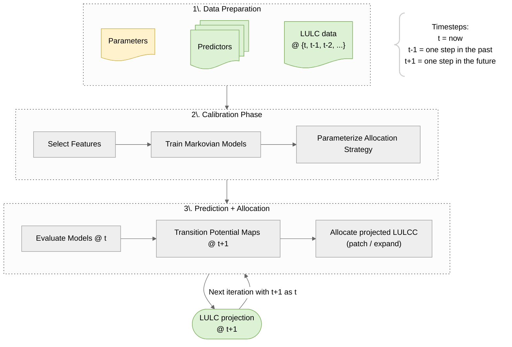

# Modelling workflow

The fundamental function of `evoland-plus` is to use a statistically calibrated, constrained model predicting locations for future land use / land cover change (LULCC), see the graph below.
Further features, such as one- or two-way coupling to other models, build on this core.

Every phase reads its inputs from and writes its results to the database described in [database.md](database.md), so that each step can be rerun, inspected or replaced by another tool independently.
The [getting-started vignette](../../vignettes/evoland.qmd) walks through the phases with the functions that implement them.
