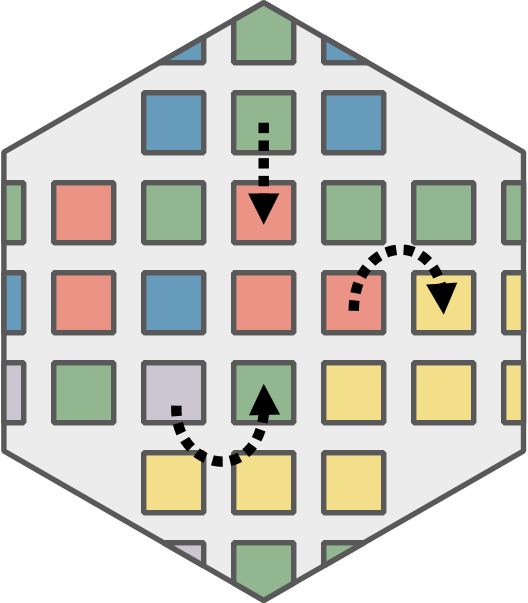

# evoland-plus 

## Overview

The `evoland-plus` R package (or `evoland` for short) provides tools for
analyzing and projecting land use evolution. The package implements a
statistically calibrated, constrained model for predicting locations of
future land use / land cover change (LULCC). The fundamental purpose of
`evoland-plus` is to:

- **Gather and process** land use/land cover data from multiple sources
  into a clearly defined database structure.
- **Calibrate statistical models** to understand historical land use
  transitions
- **Project future land use patterns** using predictive models and
  allocation algorithms
- **Support scenario analysis** through interventions and parameter
  modifications

## Installation

We suggest you use [rv](https://a2-ai.github.io/rv-docs/) to manage your
dependencies in an encapsulated environment. Simply create an
`rproject.toml` at the project root and execute `rv sync`.

``` toml
# sample rproject.toml
[project]
name = "evoland-plus"
r_version = "4.5"

repositories = [
    { alias = "CRAN", url = "https://stat.ethz.ch/CRAN/" },
]
dependencies = [
    # just use it: load using library(evoland)
    { name = "evoland", git = "https://github.com/ethzplus/evoland-plus/", branch = "main" },
]
```

If you want to develop the model logic itself, you can opt to only
install dependencies but not the package itself:

``` toml
dependencies = [    
    # only install dependencies declared in DESCRIPTION
    { name = "evoland", path = "~/path/to/local/repo", dependencies_only = true, install_suggestions = true },
    "devtools", # sundry development tasks
    "mirai", # modern multiprocessing
    "httpgd", # webview plotting
    "languageserver", # assuming your IDE loads the rv library instead of system
]
```

During development, `devtools::load_all()` acts as though you were
calling [`library(evoland)`](https://ethzplus.github.io/evoland-plus) on
an installed package. This makes it easy to rapidly reload code when
you’ve changed something.

## Contributing

PRs are very welcome! It’s probably best to first discuss the underlying
issue; @mmyrte is very happy to help figure out a solution. Code should
be autoformatted using [air](https://posit-dev.github.io/air/) before
committing. Tests are written as `tinytest`s that can be run after
package installation, ensuring that your system is set up correctly.

## Dinamica EGO

`evoland-plus` uses [Dinamica EGO](https://dinamicaego.com/) as its
spatial allocation engine. See the [Installing Dinamica
EGO](https://ethzplus.github.io/evoland-plus/articles/install-dinamica.html)
vignette for installation instructions. Note that Dinamica only runs on
**Linux x86 / amd64** (the Windows installer exists but is untested with
`evoland-plus`); users on other platforms should use the [Docker
container](https://github.com/ethzplus/rocker-geospatial-dinamica/).

## Documentation

This package uses pkgdown, see <http://ethzplus.github.io/evoland-plus>.

- **Tutorials & How-to Guides**: Package vignettes and examples in R man
  pages
- **Reference Documentation**: R man pages using the standard
  `?function_name`
- **Explanation & Design Rationale**: See the [project
  wiki](https://ethzplus.github.io/wiki) for
  - Detailed explanation of the modeling approach
  - Database schema and architecture decisions
  - Development guidelines and coding standards

## License

This project is licensed under the AGPL-3 License - see the
[LICENSE.md](https://ethzplus.github.io/evoland-plus/LICENSE.md) file
for details.

## Acknowledgments

This work represents a re-implementation and enhancement of [Benjamin
Black’s](https://ethzplus.github.io/blenback) land use model published
at <https://github.com/ethzplus/evoland-plus-legacy>, building on
substantial prior experience while modernizing the technical
implementation.
